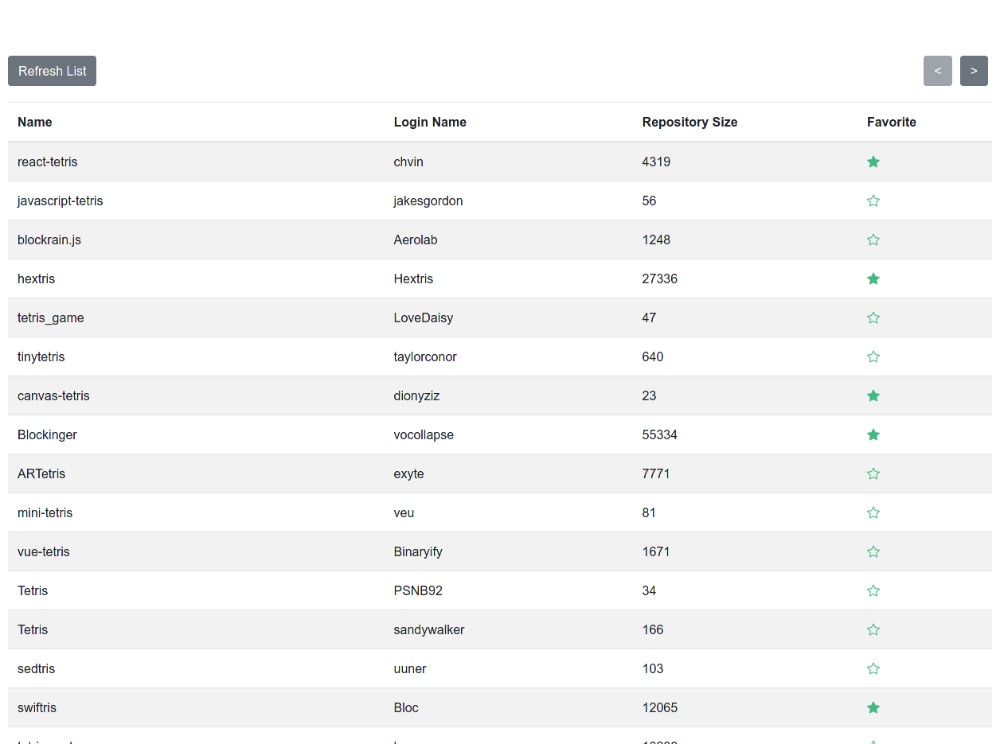

# Application



Instructions:
* Use the refresh button to reload the list 
* Use the arrows to navigate between different pages
* Click on of the star to mark the respective repository as favorite

# How run the application 
```sh 
# install dependencies
npm i --prefix backend
npm i --prefix frontend

# run both backend and frontend servers

npm start --prefix backend
npm start --prefix frontend

```

# Architecture 

This application has a standard SPA architecture with a REST api in the backend.

The frontend follows a standard component based development. 

## Frontend 
* VueJS
* ES6 (Babel)
* Bootstrap 4

## Backend
* ES6 (Babel)
* API: ExpresJS
* Data Layer: Knex and SQLITE3
* Testing: Mocha, chai and supertest

The backend can use Postgres, MSSQL, MySQL, MariaDB, SQLite3, Oracle, or Amazon Redshift as database,
depending on the configuration.

# Testing 

At this stage only backend has automated tests.

Possible future steps:

* Use cypress for both component testing and e2e testing. 
  * The component testing would allow us to make sure all components work as expected and that interactions between component work as expected
  * e2e as part of CI/CD workflow would allow us that the critical parts of our application is as expected.
* Adapt the API tests to run as e2e and be used to test the deployment in CI/CD setup


# Missing requirements

* *Set up a storage in the VueJS project, and provide a global getter and setter*
 
 I assumed that store was meant instead of storage. 
 I didn't understand if the global setter was just a way to mutate the store of it was necessary to be 
 attached to the **window** object or something similar. 

 I could improve on this if required.

# Other future improvements 

* Display API errors to the user. GitHub will reject requests if too many requests are made.
  A friendly message should be shown to the user.

* Less direct dependency on the store. Some of the components have direct access to the store. 
  
  Although this is inevitable in some of the larger page components (like large parent compoents), small components such as the pagination should be decoupled from the store and instead have its data passed as props.

* Mutate the store via events instead of direct calls. Similar to the Vuex architecture.

* Add pagination to the favorite API. 
  
  At this stage the API returns all the user's favorited repositories. This could lead to some performance problems.
* Decould the fetching of repositores from favorites. Would be desirable for performance reasons. 

* Use a better Dependency injection strategy. At this stage most modules get their dependencies 
injected but a DI framework could make the process cleaner.

* Better config management with the ability to inject config via environment variables and/or .env files

* API documentation using OpenAPI 
 